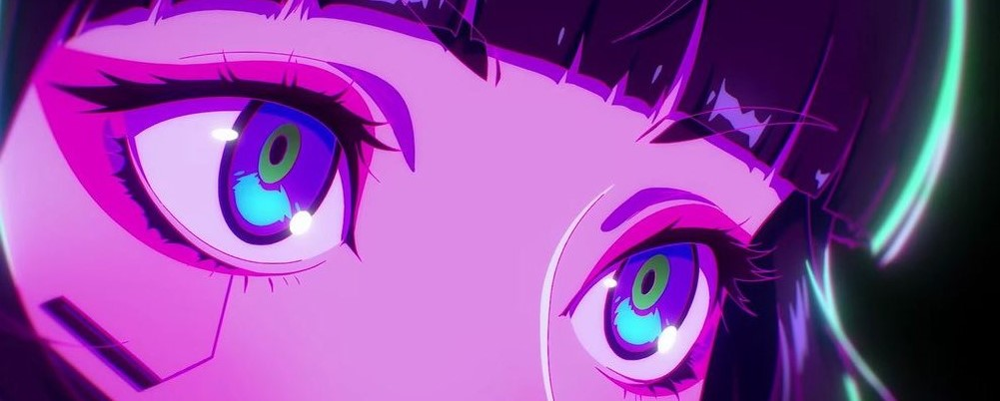

    

### Olá!🌺 Eu sou Izabelly 

**Web Developer and Gamer**

    <h2>☕ About me</h2>
    

        
        

            - 👩‍🚀 Atualmente faço graduação no curso de ADS na Fatec Jales. 
            - 👩‍🎓 Sou formada no curso de Técnico em Desenvolvimento de Sistemas pela Etec Jales. 
            - 👾 Dedico meu tempo livre para aprender coisas novas, sobre programação e tecnologias novas 
            ㅤutilizadas no mercado atualmente.
        </a>
         
         
         
        

    

    
    

## Linguagens e Tecnologias👾 ##

    
    
    
    
    
    
     
     

 
 

## Contact Me: ##

    
    
    

 

 

    
 
 
      
      

 

    

 
<picture>
  <source media="(prefers-color-scheme: dark)" srcset="https://raw.githubusercontent.com/platane/platane/output/github-contribution-grid-snake-dark.svg">
  <source media="(prefers-color-scheme: dark)" srcset="https://raw.githubusercontent.com/platane/platane/output/github-contribution-grid-snake-dark.svg">
  
</picture>

